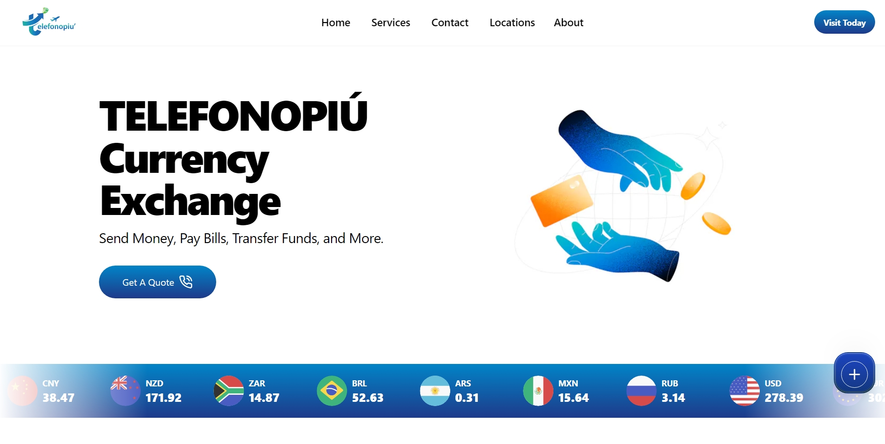

# Currency Exchange Website

This is a currency exchange website that shows real-time data from a currency API. The website is built with Next.js, Shadcn, MagicUI, and other technologies.

## Features

- Real-time currency exchange rates
- User-friendly interface
- Responsive design

## Technologies Used

- Next.js: A React framework for building modern web applications.
- Shadcn: A library for creating beautiful, custom-designed shadow effects.
- MagicUI: A UI library for building interactive, responsive, and stylish web interfaces.

## Getting Started

To get a local copy up and running, follow these steps:

1. Clone the repository:
git clone [https://github.com/your-username/your-repo.git](https://github.com/junaidsadiq-fi/CurrencyExchange)

2. Install the dependencies:

3. Start the development server:

4. Open [http://localhost:3000](http://localhost:3000) with your browser to see the result.

## Contributing

Contributions are what make the open-source community such an amazing place to learn, inspire, and create. Any contributions you make are greatly appreciated.

## License

Distributed under the MIT License. See `LICENSE` for more information.
